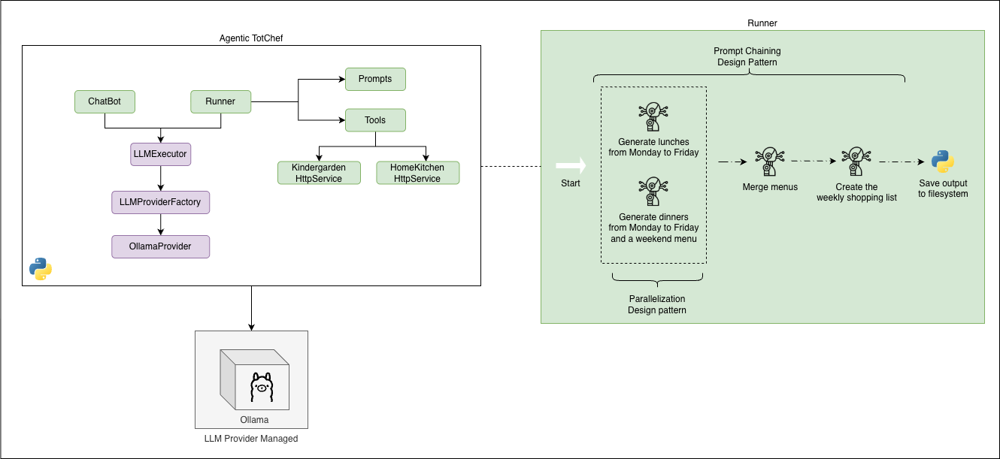

# Introduction

AI-assisted source code development is now growing at an exponential pace.
The capabilities of LLMs provided by various vendors make it possible, even in [Zero-Shot Learning](https://www.promptingguide.ai/techniques/zeroshot) mode, to generate high-quality source code with a remarkable level of abstraction and complexity.
The results, surprisingly good in my opinion, come from using so‑called **AI Agents** (in [ReAct](https://www.promptingguide.ai/techniques/react) mode and supported by [MCP Servers](https://modelcontextprotocol.io/docs/getting-started/intro)), which significantly boost developer productivity.

But let’s pause for a moment. While the world is overflowing with enthusiasm and expectations, it is important to remember that source code generation by an LLM (agentic or not) 
**is only one part of the software development process**. The demand for Software Architects will remain high, precisely to avoid building software 
that, while technically working, is underperforming, hard to maintain, scale, and extend. 

We have all worked on software projects which, although functional, carried a huge and hard‑to‑control technical debt. 
Time pressure and budget constraints often pushed quality down, leading to _quick and dirty_ solutions that solved the immediate problem but 
increased the amount of inefficient source code and, in some cases, introduced security vulnerabilities.

**The question is: in a phase where technologies are evolving so rapidly, can we really afford to make the same mistake again?** 

**The answer must be no**, also because, beyond technical debt, we now have ongoing costs to consider (AI service providers, vector databases, and more) that are anything but negligible.

If we use AI agents without a solid foundation in software design, we risk improvising architectures that work at first glance, but are neither scalable nor maintainable.
Among the risks, we find:
- "Over-engineering": designing systems that are far too complex for the problem at hand, with a consequent increase in the project’s ongoing costs. 
- Inadequate performance due to suboptimal agent design, which can lead to longer response times and a disappointing user experience.

# Goal

In this article, I will walk you through an exercise I carried out to experiment with a few _agentic design patterns_.
The exercise is built around a small demo application called **[Agentic TotChef](https://github.com/org-carmelolg-private-labs/agentic-totchef)**, whose goal is to generate 
a weekly menu for a 1‑year‑old girl, taking into account what she eats at daycare, recipes from the family cookbook, and what is currently available at home.

This experiment helped me understand both limitations and benefits, including:
- The use of SLMs (Small Language Models) to keep costs under control while still achieving satisfying results
- The adoption of design patterns and best practices to architect AI agents with solid performance characteristics

# Small Language Models: limits and benefits

While it is true that large language models (LLMs) like GPT‑5, Gemini, Claude, Grok, and others offer extraordinary capabilities, 
it is equally true that Small Language Models (SLMs) are gaining traction thanks to their efficiency and lower cost.

SLMs, such as those provided by Ollama, are designed to be lighter and cheaper to run, making them ideal for focused applications 
that do not need the full power of a massive LLM.

Some key advantages:
- **Lower cost**: SLMs are generally cheaper to use than LLMs, which makes them accessible even for projects with limited budgets.
- **Efficiency**: SLMs can be faster at generating responses, especially for well‑framed tasks that do not require deep, open‑ended reasoning.
- **Customization**: By injecting task‑specific context, you can obtain more relevant and accurate outputs, squeezing the most out of the SLM.

However, it is important to acknowledge their limitations, such as a reduced ability to handle very complex contexts or to generate highly creative, nuanced answers.
So the choice between LLM and SLM should always depend on the project’s specific needs and the goals you want to achieve.

In my case, for the TotChef project, I chose **qwen3‑8b**, which proved more than sufficient to generate weekly menus that were both accurate and relevant.
We are obviously talking about medium‑low complexity requirements and modest hardware. 
Still, it was enough to achieve a satisfying outcome with acceptable response times.

# Agentic Design Patterns: what they are

During an intense reading session, I stumbled upon a very interesting book: [Agentic Design Pattern by Antonio Gulli](https://search.worldcat.org/it/title/1547934185), Engineering Director at Google. The book describes a set of design patterns for building AI agents, with a particular focus on structuring agent workflows, handling memory, and interacting with the external environment.

As I was reading it, my mind immediately went to the [GoF](https://en.wikipedia.org/wiki/Design_Patterns) and their idea of standardizing source code production. In a way, the patterns described in Agentic Design Pattern represent an attempt to standardize the design of AI agents, offering proven solutions to recurring problems you encounter while building agentic systems.

In my sample project, [Agentic TotChef](https://github.com/org-carmelolg-private-labs/agentic-totchef), I did not have much room to apply a wide range of patterns, so I started by experimenting with the first two:
- **Prompt Chaining**: this pattern breaks down a complex task into a series of simpler steps, each handled by a dedicated AI agent.
- **Parallelization**: this pattern runs multiple AI agents in parallel to complete a task, improving overall performance and reducing response times.

For me it was both a fun game and a practical way to better understand the limits and advantages of these design patterns, and how they can be applied in real projects to improve the maintainability of AI agents.

# Agentic TotChef: software architecture

[Agentic TotChef](https://github.com/org-carmelolg-private-labs/agentic-totchef) is a little toy project that I built for several reasons:
- To test the design patterns from Agentic Design Pattern
- To see whether an SLM could deliver satisfying results
- To write _boilerplate_ code (the part highlighted in purple in the diagram) for the design of [OAIA - OrchestrAI Architecture](https://github.com/carmelolg/OAIA), a reusable template for future projects.

The diagram below illustrates the high-level architecture of Agentic TotChef:



The most interesting part of this tiny software architecture is the file **Runner**, highlighted in the green box on the right: it shows all the calls to **qwen3‑8b** and the interactions between the various agents.

In particular, you can clearly see how the **Prompt Chaining** design pattern is used to split the complex task of generating a weekly menu into a sequence of simpler steps, each implemented by a dedicated AI agent. 

The **Parallelization** pattern, on the other hand, is used to run two independent steps in parallel:
- Fetching the daycare menu and generating a lunch plan from Monday to Friday
- Creating an evening‑meal menu for the full week and weekend, taking into account what is available at home and the family recipes.

While the first pattern helped achieve a clearly better output compared to a more naive design, the second allowed me to increase the speedup of the weekly menu generation process, reducing response times and improving the overall user experience.

**Note**: I am not covering the small web application that lets you chat with TotChef, simply because it does not include any particularly interesting architectural elements: it is just an interface used to test the AI agents’ outputs at the various steps.

# Agentic TotChef: code snippet

> In this Python code example, each object that defines a step (for example `KindergartenMenuStep`) implements an `execute` method that runs the given step, interacting (via `LLMExecutor`) with _qwen3‑8b_ and returning a `StepResult` object containing the step output and execution status.

[You can find the full code here](https://github.com/org-carmelolg-private-labs/agentic-totchef/)

```python
# Step 1: Kindergarten menu
kg_step = KindergartenMenuStep()
kg_step_output: StepResult = StepResult(step_id=kg_step.step_id, result="")
# Step 2: Home menu
home_step = HomeMenuStep()
home_step_output = StepResult(step_id=home_step.step_id, result="")

# Execute both steps in parallel
with ProcessPoolExecutor() as executor:
    futures = [
        executor.submit(kg_step.execute),
        executor.submit(home_step.execute)
    ]

    for future in futures:
        single_result = future.result()
        if single_result is not None and single_result.is_success():
            if single_result.step_id == kg_step.step_id:
                kg_step_output: StepResult = single_result
            elif single_result.step_id == home_step.step_id:
                home_step_output: StepResult = single_result

# Step 3: Merge menus
merge_step = MergeMenuStep()
merge_step_output: StepResult = merge_step.execute(kg_step_output.result, home_step_output.result)

# Step 4: Shopping list
shopping_list_step = ShoppingListStep()
shopping_list_output: StepResult = shopping_list_step.execute(merge_step_output.result)

# Add step that create a Markdown file with the merged menu and shopping list
create_md_step = CreateMarkdownStep()
create_md_output: StepResult = create_md_step.execute(merge_step_output.result, shopping_list_output.result)
if create_md_output is not None and create_md_output.is_success():
    TotChef.log_element(f"Markdown created: {create_md_output.result}")
else:
    TotChef.log_element("Failed to create markdown file")
```

The output is a Markdown file that includes the weekly menu and the related shopping list.


<details>
    <summary>Here an example</summary>

    # Weekly Menu and Shopping List
    ## Menù

    | Day       | Lunch                                                                 | Dinner                                                                 |
    |-----------|------------------------------------------------------------------------|------------------------------------------------------------------------|
    | Monday    | First Course: Penne al ragù<br>Main Course: Omelette al forno<br>Side: Carote prezzemolate | First Course: Riso sugo e piselli<br>Main Course: Nasello con carote in padella<br>Side: Zucchine |
    | Tuesday   | First Course: Minestrina in brodo vegetale<br>Main Course: Spezzatino di tacchino in umido<br>Side: Purea di patate | First Course: Pasta al ragù<br>Main Course: Polpette di carne<br>Side: Fagiolini |
    | Wednesday | First Course: Passato di lenticchie con pasta<br>Main Course: Stracchino<br>Side: Costine all'olio | First Course: Pasta alla zucca<br>Main Course: Orata in friggitrice ad aria<br>Side: Costine |
    | Thursday  | First Course: Risotto alla parmigiana<br>Main Course: Bocconcini di pollo alla pizzaiola<br>Side: Finocchi lessi | First Course: Pasta alla crema di ceci<br>Main Course: Philadelphia<br>Side: Verza |
    | Friday    | First Course: Farfalle al pomodoro<br>Main Course: Filetto di pesce al limone<br>Side: Broccoli all'olio | First Course: Pasta e patate<br>Main Course: Formaggio fresco<br>Side: Cavolo nero |
    | Saturday  | First Course: Pasta al pomodoro<br>Main Course: Polpette di ceci<br>Side: Zucchine | First Course: Riso sugo e piselli<br>Main Course: Ricotta fresca<br>Side: Spinaci |
    | Sunday    | First Course: Pasta al cavolo nero<br>Main Course: Frittata<br>Side: Fagiolini | First Course: Pasta alla crema di zucchine<br>Main Course: Orata in friggitrice ad aria<br>Side: Cavolfiore |

    ## Shopping List

    ### Fruits and Vegetables  
    - Carote: 1 kg  
    - Zucchine: 1 kg  
    - Fagiolini: 1 kg  
    - Broccoli: 1 kg  
    - Finocchi: 1 kg  
    - Cavolfiore: 1 kg  
    - Cavolo nero: 1 kg  
    - Spinaci: 1 kg  
    - Piselli: 1 kg  
    - Verza: 1 kg  
    - Patate: 1 kg  
    - Lenticchie: 1 kg  
    - Riso: 1 kg  
    - Cipolle: 1 kg  
    - Aglio: 1 kg  
    - Prezzemolo: 1 mazzetto  
    - Basilico: 1 mazzetto  
    - Timo: 1 mazzetto  
    - Zafferano: 1 cucchiaino  

    ### Proteins (Meat, Fish, Eggs, etc.)  
    - Manzo: 1 kg  
    - Tacchino: 1 kg  
    - Pollo: 1 kg  
    - Pesce (filetto): 1 kg  
    - Orata: 1 kg  
    - Uova: 12 pezzi  
    - Stracchino: 200 g  
    - Philadelphia: 200 g  
    - Formaggio fresco: 200 g  
    - Ricotta fresca: 200 g  
    - Bocconcini di pollo: 1 kg  

    ### Carbohydrates (Pasta, Rice, Bread, etc.)  
    - Penne: 500 g  
    - Farfalle: 500 g  
    - Pasta alla crema di ceci: 500 g  
    - Pasta alla zucca: 500 g  
    - Pasta al cavolo nero: 500 g  
    - Pasta alla crema di zucchine: 500 g  
    - Riso: 1 kg  
    - Pane: 1 kg  

    ### Lacteos (Milk, Cheese, Yogurt, etc.)  
    - Latte: 1 litro  
    - Yogurt greco: 1 litro  
    - Formaggio grattugiato: 100 g  
    - Burro: 100 g  

    ### Legumes  
    - Ceci: 500 g  
    - Lenticchie: 1 kg  
    - Fagioli: 500 g  

    ### Other (Oils, Spices, etc.)  
    - Olio d'oliva: 1 litro  
    - Sale: 1 kg  
    - Pepe nero: 100 g  
    - Zucchero: 1 kg  
    - Aceto balsamico: 100 ml  
    - Senape: 100 ml  
    - Panna: 200 ml  
    - Salsa di soia: 100 ml  
    - Vino bianco: 1 litro  
    - Olio per friggere: 500 ml  
    - Farina: 500 g  
    - Cioccolato fondente: 100 g  
    - Cacao in polvere: 100 g  
    - Caffè: 100 g  
    - Zucchero di canna: 1 kg  
    - Miele: 100 g
</details>

# Conclusions
In this article, I shared an exercise focused on experimenting with a few *agentic design patterns* using the SLM **qwen3-8b** to generate a weekly menu suitable for a one-year-old child.

This experiment helped me identify both the strengths and limitations of these patterns, showing how they can be adopted in real-world scenarios to improve the maintainability and robustness of AI agents.

In particular, the **Prompt Chaining** pattern proved effective in breaking down a complex task into a sequence of more manageable steps, each handled by a specialized agent. The **Parallelization** pattern, on the other hand, made it possible to execute two independent steps simultaneously, boosting performance and noticeably reducing response time.

The resulting speedup achieved through this architecture was significant (around 1.5× for this use case) considering that only the two most demanding steps were run in parallel. Previous implementations, which lacked a clear separation of responsibilities and relied on monolithic agents, instead showed undesired behaviors like infinite loops and hallucinations.

For the development of [Agentic TotChef](https://github.com/org-carmelolg-private-labs/agentic-totchef), I used Python, but *agentic design patterns* are language-agnostic concepts that can be applied to any type of agent or AI model.

This project also gave me the chance to explore the world of *vibe coding* more deeply, thanks to the valuable insights of **[@gregoriolagamba](https://gregoriolagamba.github.io/)**, Solution Architect at Plenitude, who introduced me to agentic programming tools directly on GitHub.
